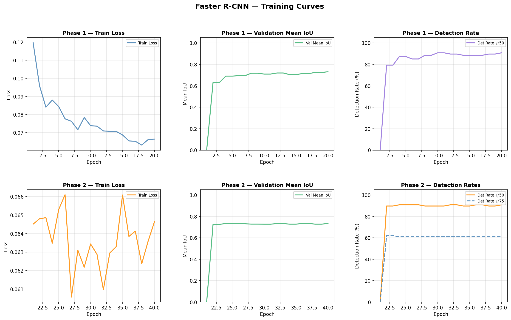
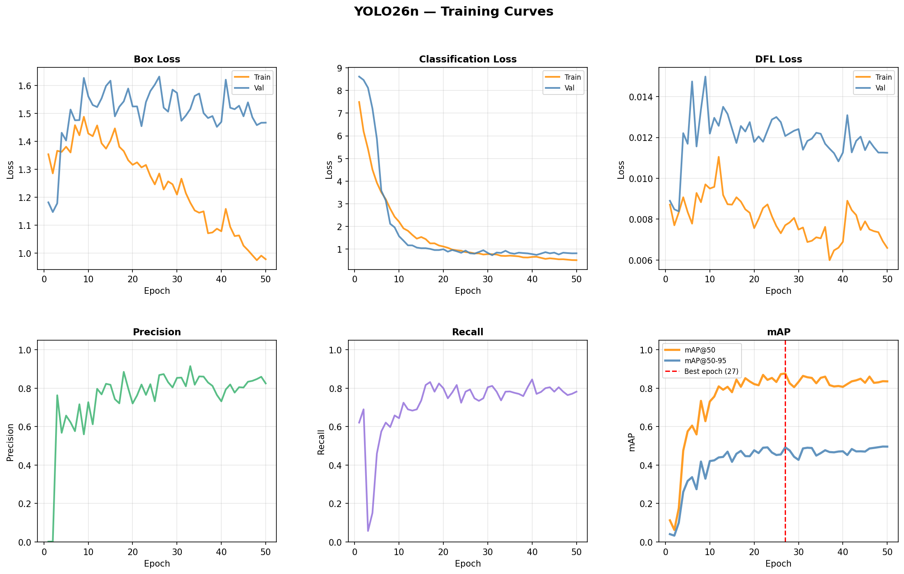
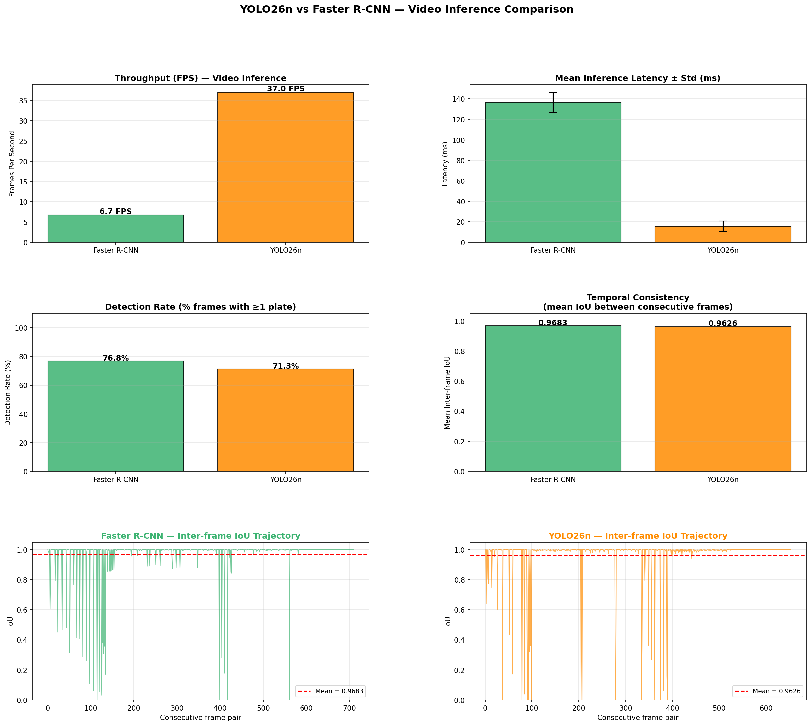
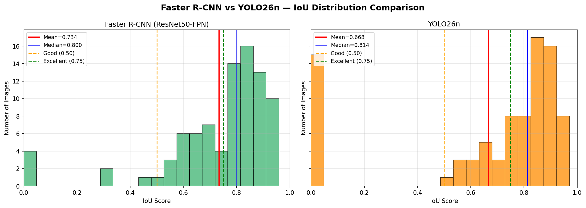
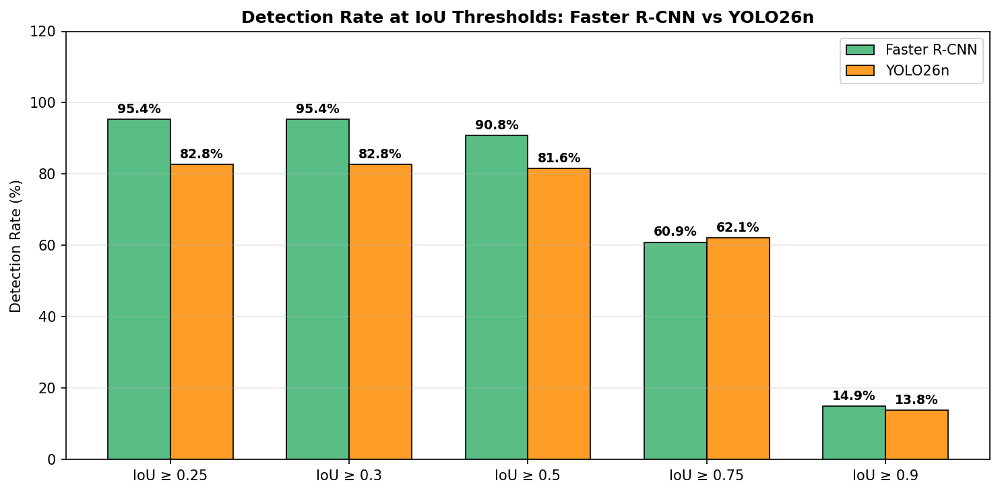
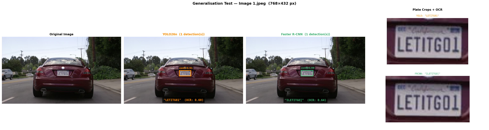
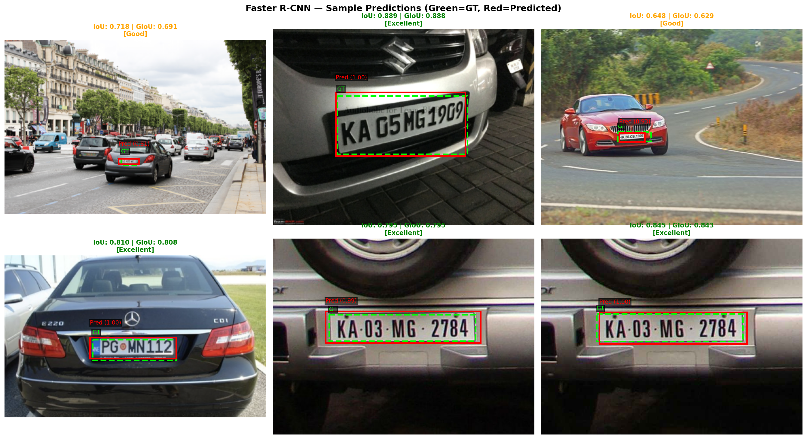
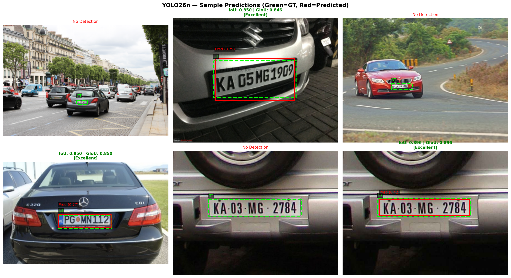

# CONSTANTINO HARRY ALEXANDER 
### [Repositories](https://github.com/ConstantinoHarry?tab=repositories) (View codes and what I have been doing recently) 

- Year 3 CS student at [HKBU](https://www.comp.hkbu.edu.hk/v1/) concentrating in Artificial Intelligence
- Currently an Associate Project Manage @ [Oursky](https://www.oursky.com)

  
        Java, DSA, application development, Maths and most importantly AI! 

# Recent Projects:

## 1. [**Architectural Tradeoffs in ALPR: YOLO26n vs Faster R-CNN**](https://github.com/ConstantinoHarry/Automatic-License-Plate-Detection--YOLO26n-vs.-Faster-R-CNN/blob/main/project_report.pdf)
- Conducted a controlled benchmarking study comparing the lightweight single-stage YOLO26n detector against a two-stage Faster R-CNN (ResNet-50 FPN backbone) for Automatic License Plate Recognition (ALPR).

### Architectures & Training
- **Faster R-CNN:** Achieved superior localization consistency with a mean IoU of 0.7233 and a lower catastrophic failure rate of 6.9%, making it ideal for accuracy-bounded, single-shot pipelines. Implemented a custom two-phase training curriculum utilizing plate-geometry-aware anchor ratios to compensate for license plate aspect ratios.
- **YOLO26n:** Delivered real-time performance with a 13.05x per-frame inference speed-up (41.6 FPS vs. 6.2 FPS on an NVIDIA T4). Recommended for throughput-bounded streaming deployments.

  
  &nbsp; &nbsp; &nbsp; &nbsp;
  

### Video Inference & Throughput
- Evaluated end-to-end video throughput and temporal consistency. Demonstrated YOLO26n's real-time streaming capabilities alongside highly stable inter-frame bounding box predictions (negligible jitter) for both models.

  

### Detection Quality & End-to-End Evaluation
- **End-to-End Evaluation:** Benchmarked the detection models through EasyOCR, demonstrating that standard geometric metrics like IoU do not fully determine downstream OCR success. 
- On generalization tests, YOLO26n produced tighter bounding box crops that yielded closer matches to the ground truth when integrated with downstream Optical Character Recognition (OCR). 

  
  &nbsp; &nbsp; &nbsp; &nbsp;
  

  

### Sample Predictions

  
  &nbsp; &nbsp; &nbsp; &nbsp;
  

## 2. [**Deep Image Colorization**](https://github.com/ConstantinoHarry/deep-image-colorization)
- Deep image colorization using a Pix2Pix-style cGAN: a ResNet‑18–backed U‑Net predicts Lab color ab channels from grayscale L, with a PatchGAN discriminator enforcing local realism. A hybrid objective (L1 + adversarial + LPIPS) plus optional FAISS retrieval hints improves vibrancy and training stability. Trained on a curated Kaggle subset; results include PSNR ≈ 22.53 dB and SSIM ≈ 0.9162.

- Semantic grayscale‑to‑color translation with ResNet‑UNet + PatchGAN in Lab space. Hybrid losses (L1 + GAN + LPIPS) and optional FAISS retrieval guidance produce vibrant, realistic colors with stable training. Colab‑ready notebook with reproducible setup, training, evaluation, and galleries.

## 3. [**FISCAL WISER**](https://github.com/ConstantinoHarry/Web-Development)
- FiscalWiser is a comprehensive financial planning web application designed to help users track income, expenses, budgets, retirement goals, and simulate paper trading for stocks and cryptocurrencies. The platform provides interactive charts, summary metrics, and persistent data storage for a seamless personal finance experience.

## 4. [**AIIGood - AI Companion for Mental Wellness Across All Ages**](https://github.com/ConstantinoHarry/JUMPSTARTER-SDG-Hackathon)
[**Initial Interface**](https://constantinoharry.github.io/JUMPSTARTER-SDG-Hackathon/) 
- AIIGood is an innovative AI-powered mental wellness platform designed to provide 24/7 anonymous support for children, adults, and the elderly in Hong Kong. Our solution addresses the growing mental health crisis by combining cutting-edge AI technology with compassionate care, reducing stigma and improving access to mental health resources.

  Team: AIIGood (Granville & Harry)

## 🌐 Connect With Me

## 🛠️ Tech Stack

### 🤖 AI/ML & Data Science

### 🌐 Web Development & APIs

### 🔧 Development Environments

### 📚 Version Control & Tools

<!---
ConstantinoHarry/ConstantinoHarry is a ✨ special ✨ repository because its `README.md` (this file) appears on your GitHub profile.
You can click the Preview link to take a look at your changes.
--->
